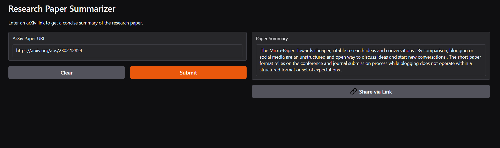

# 📚 ArXiv Digest — Research Paper Summarizer

**ArXiv Digest** is a Gradio-powered app that extracts and summarizes research papers directly from arXiv.org using state-of-the-art NLP models. It helps you understand long, complex academic papers quickly and efficiently.

---

## 🚀 Features

- 🔗 Paste an arXiv paper URL (e.g., `https://arxiv.org/abs/2106.01345`)
- 📥 Downloads the PDF and extracts up to 10,000 characters of content
- 🧠 Summarizes using HuggingFace's `DistilBART` model
- 🖥️ Simple and interactive web interface via Gradio

---

## 🛠️ Tech Stack

| Tool/Library          | Purpose                                  |
|-----------------------|------------------------------------------|
| Python                | Core language                            |
| HuggingFace Transformers | Summarization model                  |
| PyTorch               | Model inference backend                  |
| pdfminer.six          | PDF text extraction                      |
| Requests              | Downloading PDFs                         |
| Gradio                | Web interface                            |

---

## 📦 Installation

1. **Clone the repo**

```bash
git clone https://github.com/Sharanya-krishnamurthi/ArxivDigest.git
cd ArxivDigest
````

2. **Install dependencies**

```bash
pip install -r requirements.txt
```

3. **Run the app**

```bash
python app.py
```

---

## 📜 Example

**Input:**

```
https://arxiv.org/abs/2106.01345
```

**Output:**

```
Summary: This paper proposes...
```

---

## 🧪 Model Used

* **Model Name**: `sshleifer/distilbart-cnn-12-6`
* **Type**: Transformer-based abstractive summarization
* **Framework**: Hugging Face Transformers

---

## 🧾 `requirements.txt`

```txt
torch>=2.0.0
transformers>=4.35.0
gradio>=4.0.0
pdfminer.six>=20221105
requests>=2.28.1
```

---

## 🖼️ Screenshot



---

## ⚠️ Limitations

* Only works for papers available on arXiv
* May fail on large/complex PDFs or those without extractable text
* Summary length and quality may vary depending on paper structure

---


